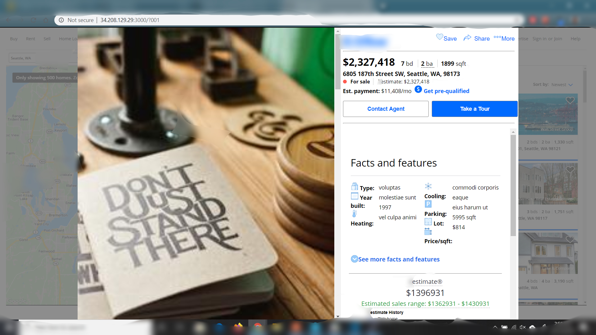

# Zilhome-proxy

> Zilhome, an open source real estate listing application.

This application was built by a team, but all the work herein is my own.


This module represents the combination of all services being render by this proxy service.



## Table of Contents
1. <a href="#how_to_use">How To Use</a>
2. <a href="#requirements">Requirements</a>
3. <a href="#related_projects">Related Projects</a>
## <a id="how_to_use">How To Use</a>
```
# clone this repository
$ git clone https://github.com/1021s/Kyle-proxy.git

# install dependencies
$ npm install

# start express server
$ npm start
```
Visit localhost:3000/


## <a id="requirements">Requirements</a>
* [npm](https://www.npmjs.com/)
* [Node.js](https://nodejs.org/en/download/)
* [Git](https://git-scm.com/)
